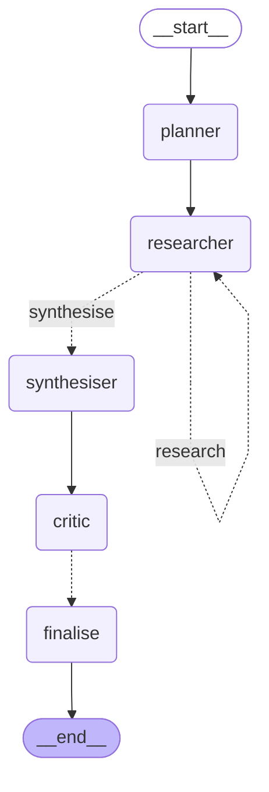
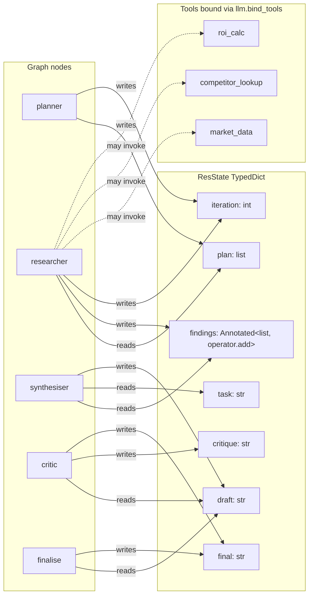
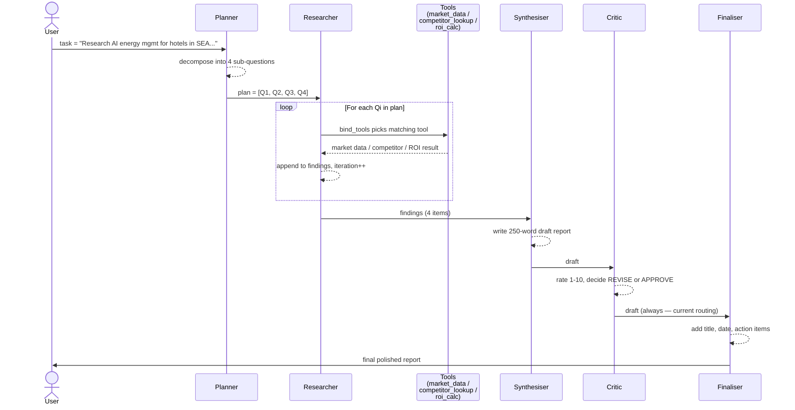

# Ex 13 — Autonomous Research Agent · Diagrams

Three views of the same system, each answering a different question:
1. **Graph topology** (what are the nodes and edges?) — auto-generated by LangGraph
2. **System architecture** (what tools and state are involved?) — hand-authored
3. **Execution sequence** (what happens in one run?) — hand-authored

---

## 1. Graph Topology — auto-generated

`graph.get_graph().draw_mermaid()` output. Source also saved as `graph.mmd`,
rendered PNG at `graph.png`.



**Key edges:**

| Edge | Type | Meaning |
|---|---|---|
| `__start__ → planner` | direct | always enter via planner |
| `planner → researcher` | direct | move to research after planning |
| `researcher → researcher` | conditional (`research`) | loop while iteration < len(plan) |
| `researcher → synthesiser` | conditional (`synthesise`) | exit loop when all questions answered |
| `synthesiser → critic` | direct | always review the draft |
| `critic → finalise` | conditional | always finalise (could revise based on `final` field) |
| `finalise → __end__` | direct | terminal |

The dotted arrows are conditional edges; solid arrows are unconditional.

---

## 2. System Architecture — tools + state

LangGraph's auto-diagram doesn't show tools (they're bound to the LLM, not
graph nodes) or the state schema. This view fills that gap.



**Why this matters:** the Researcher is the only node that calls tools.
Its decision to call (or not call) a tool is delegated to Claude via
`llm.bind_tools(TOOLS)` — Claude inspects each question and picks the
right tool by name match.

---

## 3. Execution Sequence — one run

Sequence diagram of a real execution. Compresses the recursive
`researcher → researcher` loop into 4 iterations.



---

## Theory mapping

This is the **Planner-Executor-Critic (PEC)** pattern from agent literature:

| PEC role | Ex 13 node | Wooldridge BDI parallel |
|---|---|---|
| Planner | `planner` | Deliberation — what states to achieve |
| Executor | `researcher` (+ tools) | Means-ends reasoning — how to achieve them |
| Critic | `critic` | Filter of admissibility — quality gate |

The bounded autonomy (`iteration < len(plan)`) implements **Bratman's
intention persistence** — the agent commits to executing all planned
questions before re-deliberating.

---

## How to render

- **VS Code / GitHub / mermaid.live**: paste the ` ```mermaid ` block into
  any Mermaid-aware renderer
- **PNG export**: `graph.png` is already in this folder (auto-generated
  via mermaid.ink)
- **Raw source**: `graph.mmd` is the LangGraph-generated Mermaid

To regenerate after code changes:

```python
from ex13_autonomous_research import graph
print(graph.get_graph().draw_mermaid())
graph.get_graph().draw_mermaid_png(output_file_path="graph.png")
```
